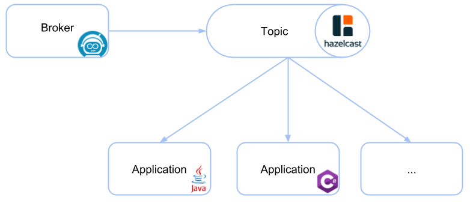

# zeebe-hazelcast-exporter

[](https://github.com/camunda-community-hub/community)

[](https://github.com/Camunda-Community-Hub/community/blob/main/extension-lifecycle.md#stable-)
[](https://opensource.org/licenses/Apache-2.0)
[](https://travis-ci.org/zeebe-io/zeebe-hazelcast-exporter)

Export records from [Zeebe](https://github.com/zeebe-io/zeebe) to [Hazelcast](https://github.com/hazelcast/hazelcast/). Hazelcast is an in-memory data grid which is used as a transport layer.



The records are transformed into [Protobuf](https://github.com/zeebe-io/zeebe-exporter-protobuf) and added to one [ringbuffer](https://hazelcast.com/blog/ringbuffer-data-structure/). The ringbuffer has a fixed capacity and will override the oldest entries when the capacity is reached.

Multiple applications can read from the ringbuffer. The application itself controls where to read from by proving a sequence number. Every application can read from a different sequence. 

The Java and C# connector modules provide a convenient way to read the records from the ringbuffer.

## Usage

### Java Application

Add the Maven dependency to your `pom.xml`

```
<dependency>
	<groupId>io.zeebe.hazelcast</groupId>
	<artifactId>zeebe-hazelcast-connector</artifactId>
	<version>%{VERSION}</version>
</dependency>
```

Connect to Hazelcast and register a listener 

```java
ClientConfig clientConfig = new ClientConfig();
clientConfig.getNetworkConfig().addAddress("127.0.0.1:5701");
HazelcastInstance hz = HazelcastClient.newHazelcastClient(clientConfig);

final ZeebeHazelcast zeebeHazelcast = ZeebeHazelcast.newBuilder(hz)
    .addWorkflowInstanceListener(workflowInstance -> { ... })
    .readFrom(sequence) / .readFromHead() / .readFromTail()
    .build();

// ...

zeebeHazelcast.close();
```
## Install

### Docker

A docker image is published to [DockerHub](https://hub.docker.com/r/camunda/zeebe-with-hazelcast-exporter) that is based on the Zeebe image and includes the Hazelcast exporter (the exporter is enabled by default).

```
docker pull camunda/zeebe-with-hazelcast-exporter:latest
```

For a local setup, the repository contains a [docker-compose file](docker/docker-compose.yml). It starts a Zeebe broker with the Hazelcast exporter. The version of the exporter is defined in the `.env` file. 

```
mvn clean install -DskipTests
cd docker
docker-compose up
```

### Manual

1. Download the latest [Zeebe distribution](https://github.com/zeebe-io/zeebe/releases) _(zeebe-distribution-%{VERSION}.tar.gz
)_

1. Copy the exporter JAR  into the broker folder `~/zeebe-broker-%{VERSION}/exporters`.

    ```
    cp exporter/target/zeebe-hazelcast-exporter-%{VERSION}-jar-with-dependencies.jar ~/zeebe-broker-%{VERSION}/exporters/
    ```

1. Add the exporter to the broker configuration `~/zeebe-broker-%{VERSION}/config/application.yaml`:

    ```
    zeebe:
      broker:  
        exporters:
          hazelcast:
            className: io.zeebe.hazelcast.exporter.HazelcastExporter
            jarPath: exporters/zeebe-hazelcast-exporter-%{VERSION}-jar-with-dependencies.jar
    ```

    For broker version < 0.23.0-alpha2 `~/zeebe-broker-%{VERSION}/conf/zeebe.cfg.toml`:
    
    ```
    [[exporters]]
    id = "hazelcast"
    className = "io.zeebe.hazelcast.exporter.HazelcastExporter"
    jarPath = "exporters/zeebe-hazelcast-exporter-%{VERSION}-jar-with-dependencies.jar"
    ```

1. Start the broker
    `~/zeebe-broker-%{VERSION}/bin/broker`

### Configuration

In the Zeebe configuration file, you can change 

* the Hazelcast port
* the value and record types which are exported
* the ringbuffer's name
* the ringbuffer's capacity
* the ringbuffer's time-to-live
* the record serialization format

Default values:

```
zeebe:
  broker:
    exporters:
      hazelcast:
        className: io.zeebe.hazelcast.exporter.HazelcastExporter
        jarPath: exporters/zeebe-hazelcast-exporter.jar
	args:
	  # Hazelcast port
    	  port = 5701
    
          # comma separated list of io.zeebe.protocol.record.ValueType to export or empty to export all types 
          enabledValueTypes = ""
    
          # comma separated list of io.zeebe.protocol.record.RecordType to export or empty to export all types
          enabledRecordTypes = ""
        
          # Hazelcast ringbuffer's name
          name = "zeebe"
    
          # Hazelcast ringbuffer's capacity
          capacity = 10000 

          # Hazelcast ringbuffer's time-to-live in seconds. Don't remove the records until reaching the capacity by setting it to 0.  
          timeToLiveInSeconds = 0

          # record serialization format: [protobuf|json]
          format = "protobuf"
```

The values can be overridden by environment variables with the same name and a `ZEEBE_HAZELCAST_` prefix (e.g. `ZEEBE_HAZELCAST_PORT`). 

#### Connect to an External/Remote Hazelcast Cluster

By default, the exporter creates an in-memory Hazelcast instance and publishes the records to it. But it can also be configured to export the records to a remote/external Hazecast instance by setting the argument `remoteAddress` or the environment variable `ZEEBE_HAZELCAST_REMOTE_ADDRESS` to the address of the remote Hazelcast instance.

<details>
  <summary>Full docker-compose.yml with external Hazelcast</summary>
  <p>
		
```
version: "2"

networks:
  zeebe_network:
    driver: bridge

services:
  zeebe:
    container_name: zeebe_broker
    image: camunda/zeebe:0.23.1
    environment:
      - ZEEBE_LOG_LEVEL=debug
      - ZEEBE_HAZELCAST_REMOTE_ADDRESS=hazelcast:5701
    ports:
      - "26500:26500"
      - "9600:9600"
    volumes:
      - ../exporter/target/zeebe-hazelcast-exporter-${EXPORTER_VERSION}-jar-with-dependencies.jar:/usr/local/zeebe/exporters/zeebe-hazelcast-exporter.jar
      - ./application.yaml:/usr/local/zeebe/config/application.yaml
    networks:
      - zeebe_network
    depends_on:
      - hazelcast

  hazelcast:
    container_name: hazelcast
    image: hazelcast/hazelcast:4.0.1
    ports:
      - "5701:5701"
    environment:
      - JAVA_OPTS="-Dhazelcast.local.publicAddress=hazelcast:5701"
    networks:
      - zeebe_network
      
  hazelcast-management:
    container_name: hazelcast-management
    image: hazelcast/management-center:4.0.1
    ports:
      - "8083:8080"
    networks:
      - zeebe_network
    depends_on:
      - hazelcast    
```      

</p>
</details>
	

## Build it from Source

The exporter and the Java connector can be built with Maven

`mvn clean install`

## Code of Conduct

This project adheres to the Contributor Covenant [Code of
Conduct](/CODE_OF_CONDUCT.md). By participating, you are expected to uphold
this code. Please report unacceptable behavior to
code-of-conduct@zeebe.io.
